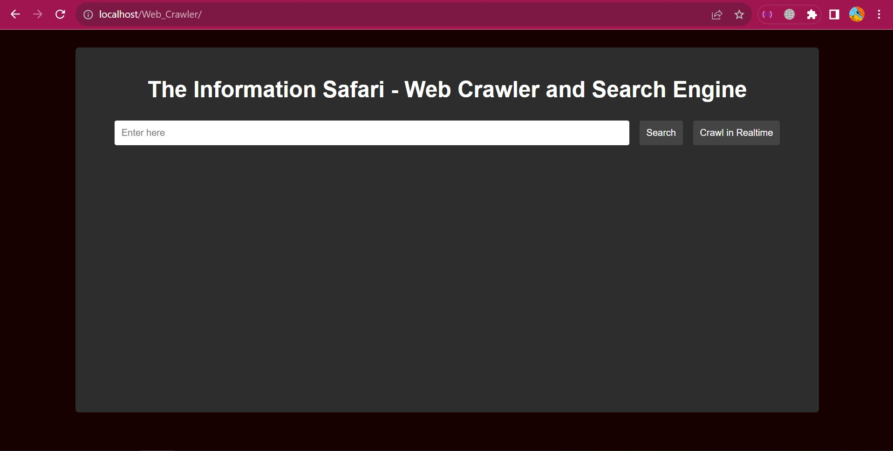
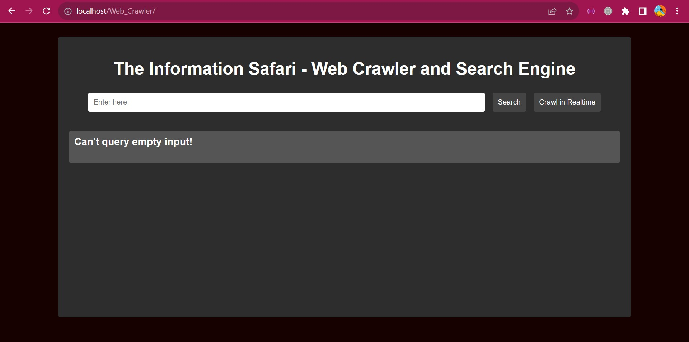
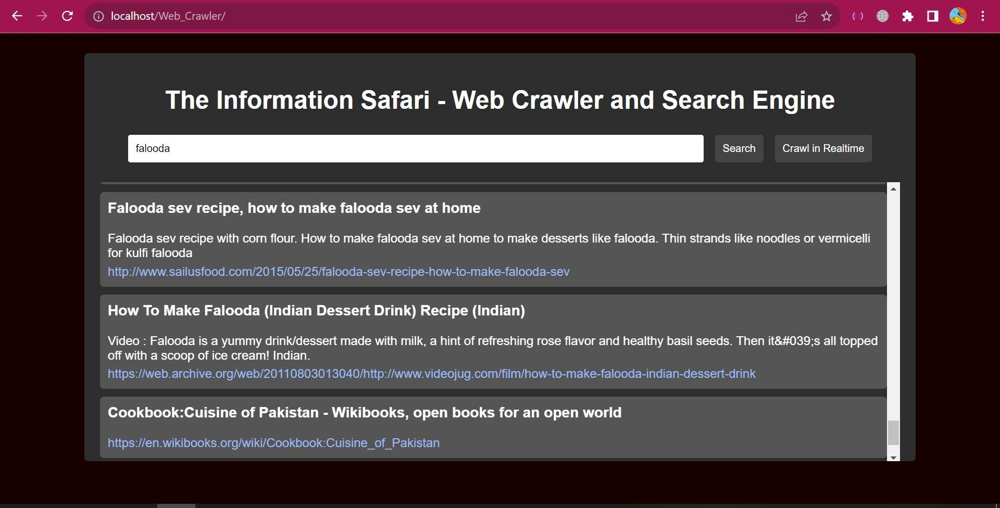
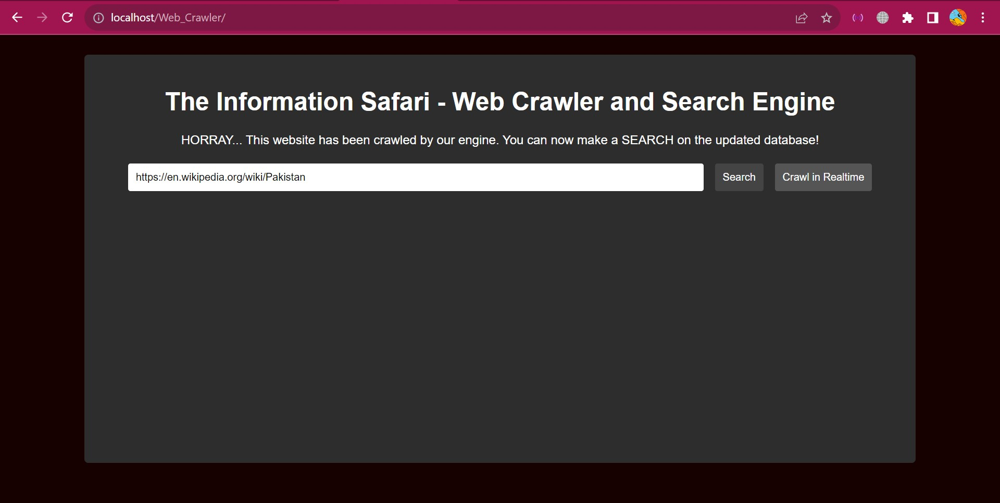
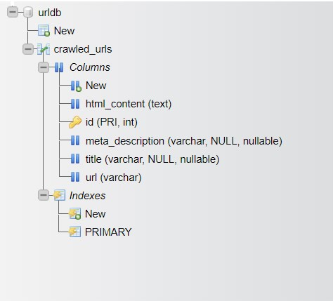

# The Information Safari - Web Crawler and Search Engine

The Information Safari is a web crawler and search engine designed to navigate the internet for collecting valuable information and enabling basic search functionalities.

## Overview

The primary goal of this project is to create a robust web crawler capable of traversing various websites, extracting relevant data such as titles, meta descriptions, and content, and indexing it for a comprehensive search experience.

## Features

- **Real-time Web Crawling and Personalized Search:** Users can crawl a website of thier own choice in real-time and update our database. They can then make search for content on the newly crawled website.
- **Data Extraction:** Gather titles, meta descriptions, and content.
- **Search Engine:** Search indexed data for relevant information.
- **User Interface:** Clean and intuitive interface for easy interaction.

## Technologies Used

- HTML
- CSS
- Javascript
- PHP

## Main Functions and Concepts Used from Programming Languages

### JavaScript (JS)

- **Fetch API:** Utilized Fetch for making asynchronous requests to the server for handling responses in the web crawler and search functionalities.
- **FormData:** Employed FormData to handle form data and facilitate sending it seamlessly within Fetch requests.

### PHP

- **DOMDocument and DOMXPath:** Utilized these to parse and navigate HTML content to enable the extraction of specific elements or data from crawled web pages.
- **cURL:** Utilized cURL for making HTTP requests to web pages, allowing retrieval and handling of webpage content programmatically.
- **preg_match_all:** Used to perform pattern matching against HTML content, i.e., to extract anchor tags.

## Getting Started

### Prerequisites

- PHP (v.8.3.0 or above)
- XAMPP Server
- Any Browser

### Installation

1. Install prerequisites mentioned above.

2. Clone the repository.

   ```sh
   git clone https://github.com/tayyibgondal/Web_Crawler.git
   ```

3. Place the cloned folder under htdocs folder i.e.,

   ```sh
   C:\xampp\htdocs\ (Windows)

   ```

4. Navigate to the project directory.

   ```sh
   cd C:\xampp\htdocs\Web_Crawler (Windows)
   ```

5. Run XAMPP server

6. Open a browser.

7. To create initial database setup, type:

   ```sh
   http://localhost/Web_Crawler/db/db_setup.php
   ```

8. Then, to crawl over Wikipedia and fill the database with Wikipedia's website data, run:

   ```sh
   http://localhost/Web_Crawler/crawl.php
   ```

   OR

9. To crawl a specific website of your own choice or to do search over the Web, type the following in browser:

   ```sh
   http://localhost/Web_Crawler/
   ```

   **CAUTION:** If the crawling process takes too long, consider increasing the `max_execution_time` variable in the `C:\xampp\php\php.ini` file to prevent any errors.

10. Finally, you can enjoy my application: **The Information Safari**!!!

## User Interface

### 1. Landing Page



### 2. Querying Empty String (Not entering anything in the Search Bar)



### 3. Searching



### 4. Realtime Crawling of a Website (of User's Choice)



### 5. Database Schema


